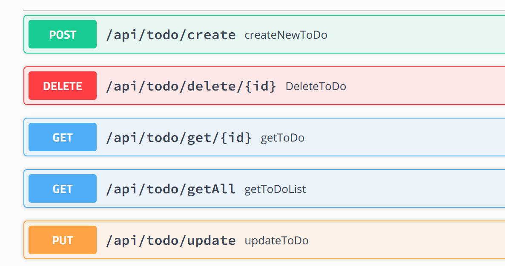
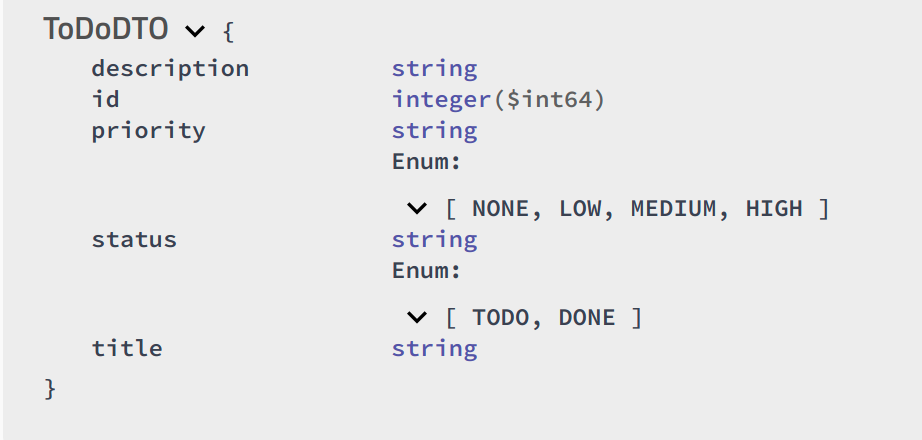

# ToDoApplication
Simple ToDo App using:  
<ul>
<li>spring-boot, spring data-jpa</li>
<li>postgres </li>
<li>docker</li>
</ul>

###Run the application from command line
`mvn spring-boot run`

The application will run on: 
`http://localhost:8080/`  
:
###The endpoints list can be found from here:
Run the application and go to this url: 
http://localhost:8080/swagger-ui.html#/

Snapshot of the list:

Here is the entity to use while making request:

##Running on docker
Create the jar:  
`mvn clean package`

###Build the docker image
`docker build --tag=todo:latest .`
###Run the Docker image
`docker run -p 8080:8080 todo:latest`
